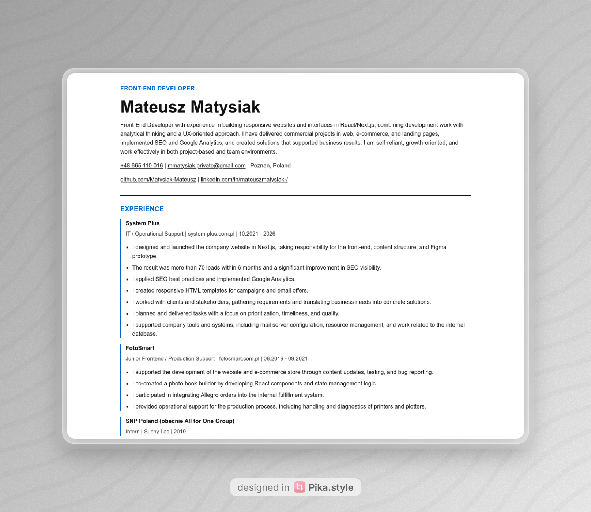

# Single-Page-CV

This project is based on the roadmap.sh challenge:
https://roadmap.sh/projects/single-page-cv

## Live Demo

Demo version:
https://single-page-cv-two-pi.vercel.app/

## Preview

It is part of my personal series of projects created to refresh core front-end fundamentals and test new solutions available in Vanilla CSS, HTML and JS.

## Project Goal

The goal of this project is to learn how to build a structured, single-page CV using HTML with a clean and semantic layout. Styling is introduced as a later step, but this repository already includes a minimal CSS implementation as part of my practice workflow.

## What This Project Covers

- Semantic HTML structure for a clear, accessible CV layout.
- Essential SEO meta tags in the `head` section.
- Open Graph (OG) tags for better social sharing previews.
- A favicon linked in the `head` section.
- Single-page organization of education, skills, and career history.

## Key Requirements (roadmap.sh)

- Use semantically correct HTML tags.
- Build a single-page CV layout.
- Include SEO meta tags.
- Include Open Graph tags.
- Add a favicon.
- Keep the structure clear and ready for further styling.

## Submission Checklist

- [x] Semantically correct HTML structure.
- [x] Single-page layout with sections for education, skills, and career history.
- [x] SEO meta tags in the head section.
- [x] OG tags for better social media sharing.
- [x] A favicon linked in the head section.

## Learning Outcome

By completing this project, I strengthened my understanding of:

- structuring content with semantic HTML,
- applying basic SEO metadata,
- preparing documents for social sharing,
- creating a solid base for iterative styling with CSS.

